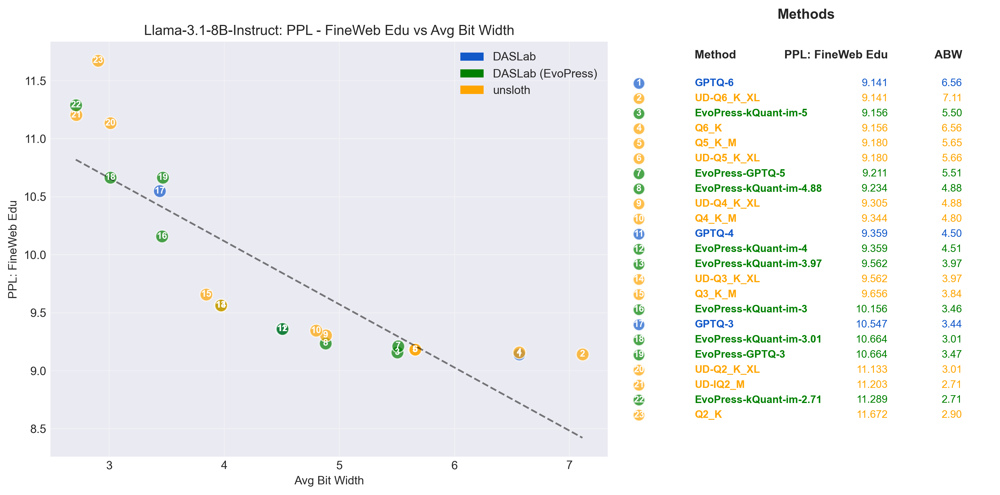
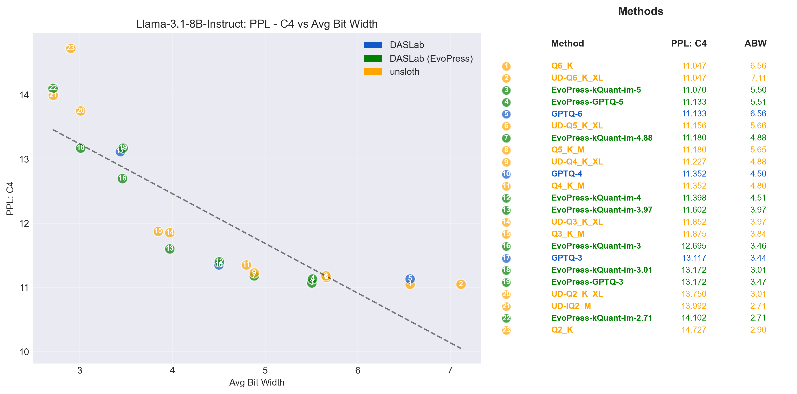
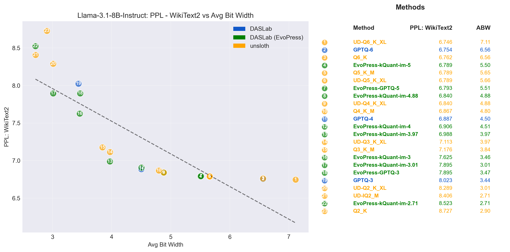
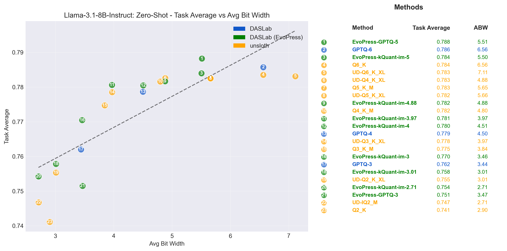

# GGUF Quantization Toolkit

The GGUF format has emerged as the standard for efficient LLM deployment, enabling local inference on consumer hardware through optimized quantization schemes. However, support for heterogeneous quantization and advanced model compression techniques in GGML can still be improved to match or surpass the state-of-the-art academic results. In turn, this can improve the quality-compression tradeoffs.

This repository bridges that gap by providing DASLab's state-of-the-art model compression techniques for GGUF models. We implement:

- **GPTQ quantization** with direct GGUF export, offering improved quality compared to naive quantization approaches, by enabling error-correcting updates during the calibration process
- **EvoPress** evolutionary search for discovering optimal per-layer quantization configurations  
- **Model assembly tools** for converting research configurations into production-ready GGUF models

The toolkit enables researchers and practitioners to move beyond uniform quantization, systematically exploring mixed-precision configurations that achieve better quality-compression tradeoffs. By bringing advanced compression research to the GGUF ecosystem, we aim to democratize access to efficient, high-quality quantized models.

## Workflow Overview

The toolkit follows a three-stage pipeline for optimized GGUF quantization:

### 1. Uniform Quantization
The goal of this first step is to create an accurate quantized model with uniform per-layer quantization. Specifically, it enables to create quantized model variants using either:
- **Standard GGUF quantization formats** (Q2_K, Q3_K, Q4_K, Q5_K, Q6_K) via the `llama-quantize` tool
- **GPTQ quantization** with K-quant export for higher quality compression

### 2. Search & Optimization
The second step enables to create a high-quality non-uniformly quantized model. Specifically, one can build a database of quantized layers and use the **EvoPress** algorithm to discover optimal per-layer configurations:
- Convert GGUF models into searchable layer databases using `mapper/` utilities
- Run evolutionary search to find mixed-precision configurations that maximize quality under size constraints
- Generate configuration files specifying bitwidth per layer

### 3. Model Assembly
Transform EvoPress configurations into functional GGUF models:
- Use `mapper/gguf_stitcher.py` to reconstruct complete models from optimized layer configurations
- Handle HuggingFace ↔ GGUF naming conversions and metadata preservation
- Output production-ready GGUF files for deployment

The `eval/` directory provides an evaluation tool for perplexity testing, zero-shot benchmarks, and model inspection throughout the process.

## Why GPTQ? 

### Overview

This project explores **GPTQ** quantization combined with the **K-Quants** provided by the [GGUF](https://github.com/ggerganov/llama.cpp) format.
The main goal is to extend GPTQ with K-Quants (`Q2_K`, `Q3_K`, `Q4_K`, `Q5_K`, `Q6_K`) to improve model quality and enable the first generation of **GPTQ-GGUF models**. This is non-trivial because of the non-trivial complexity of some GGUF formats. 

#### Differences between GPTQ and K-Quants?

* **GPTQ**: flexible, supports symmetric/asymmetric quantization and varying group sizes.
* **K-Quants**: asymmetric (except for Q3\_K and Q5\_K), fixed group sizes, double-quantization of scales.

By combining the two:

* We can calculate K-Quant scales and offsets without using an i-matrix.
* Then apply GPTQ for further improvements.
* This results in higher-quality GGUF quantized models.

For background, see the original `GPTQ` paper and the description of K-Quants in the [llama.cpp repo](https://github.com/ggerganov/llama.cpp) or in the `Mind the Gap: A Practical Attack on GGUF Quantization` paper.

---

### Execution

To quantize a model, use the provided script:

```bash
bash run_quant.sh "Q4_K"
```

You can override defaults via environment variables (e.g. `CUDA_VISIBLE_DEVICES=0,1`) or by editing the script.

### Important Parameters

* `--quantizable_modules '.*layers.*((q|k|v|o|gate|up|down)_proj)$'`
  A **regex** defining which modules to quantize. Here it targets all projection layers inside transformer blocks (`q, k, v, o, gate, up, down`).

* `--pre_block_modules model.embed_tokens`
  Modules applied **before** transformer blocks (e.g. embeddings).

* `--block_modules model.layers`
  The main transformer **block stack**.

* `--post_block_modules lm_head`
  Modules applied **after** transformer blocks (e.g. final classifier / output head).

* `--quant_non_block_modules`
  If set, quantizes non-transformer block modules as well (pre_block_modules + post_block_modules).

* `--default_bit_width "${BITS:-Q4_K}"`
  Default quantization scheme if no custom config is provided (e.g. `Q4_K`, `Q6_K`).

* `--bit_width_configuration "${BIT_WIDTH_CONFIGURATION:-./config.json}"`
  JSON file allowing **per-layer bitwidth control**. Example:

  ```json
  {
      "q_proj": "Q3_K",
      "k_proj": "Q2_K",
      "v_proj": "Q4_K",
      "o_proj": "Q5_K",
      "gate_proj": "Q6_K",
      "down_proj": "Q3_K",
      "up_proj": "Q4_K",
      "embed_tokens": "Q6_K",
      "lm_head": "Q6_K"
  }
  ```

---

### Packing into GGUF

After quantization, results are stored in a directory (containing quantized weights and scale/offset metadata).
To package this into a `.gguf` file, use the adapted packing script:

```bash
python pack_gptq_into_gguf.py ./path-to-original-model \
    --dir_model_quant ./path-to-quantized-model \
    --outfile ./model.gguf \
    --outtype f16
```

Notes:

* Q3\_K and Q5\_K are symmetric → shifted only during packing.
* Other bitwidths are shifted already during quantization.
* See llama.cpp code for detailed handling of K-Quant differences.

#### Additional Resources

We provide a simple script to export existing GPTQ models stored in the compressed tensors format into GGUF using Q4_0 quants. Therefore, this script currently supports models that do not use dynamic reordering of scales during (de-)quantization and that are symmetric within 4-bit quantization. These are the most commonly produced models 

Support for asymmetric quantization can be added with minimal effort, and the script has been designed to make such extensions straightforward. The implementation is adapted from the original GPTQ packing logic.

```bash
python pack_compressed_tensors_into_gguf.py ./path-to-original-model \
    --dir_model_quant ./path-to-quantized-model \
    --outfile ./model.gguf \
    --qtype q4_0 \
    --outtype f16
```

Notably, the script can also be adapted to support other storage formats that use different naming conventions for the individual parts of the quantized weights. To do this, simply adjust the mappings in lines 316–332 of the script.

---

## Complete Workflow Example

Here's an example using `meta-llama/Llama-3.2-1B-Instruct` to demonstrate the full quantization optimization process:

**Disclaimer**: This is a simplified example for demonstration. Actual results may vary based on model, data, and parameters. Please adapt as needed.

### Step 1: Model Quantization

The first step creates multiple quantized versions of your model. You have two approaches:

#### Option A: GPTQ Quantization (Recommended for higher bitwidths)

```bash
cd quant/gptq

# Run GPTQ quantization - this will create multiple bitwidth variants
./run_quant.sh "Q2_K"
./run_quant.sh "Q3_K"
./run_quant.sh "Q4_K"
./run_quant.sh "Q5_K"
./run_quant.sh "Q6_K"

# Creates: 
# - Llama-3.2-1B-Instruct_Q2_K.gguf
# - Llama-3.2-1B-Instruct_Q4_K.gguf  
# - Llama-3.2-1B-Instruct_Q6_K.gguf
# ...
```

#### Option B: Standard K-Quants

```bash
cd quant/gguf

# Quantize to multiple formats
./run_quant.sh ./models/Llama-3.2-1B-Instruct.gguf "Q2_K Q3_K Q4_K Q5_K Q6_K"

# Creates: 
# - Llama-3.2-1B-Instruct_Q2_K.gguf
# - Llama-3.2-1B-Instruct_Q4_K.gguf  
# - Llama-3.2-1B-Instruct_Q6_K.gguf
# ...
```

### Step 2: Build EvoPress Database

The database creation process organizes quantized layers for efficient search. We use the automated database builder:

```bash
cd mapper

# Build the database from multiple quantized models (both GPTQ and K-Quants are supported)
./build_ep_database.sh --models \
    ../quant/gguf/quantized_models/Llama-3.2-1B-Instruct_Q2_K.gguf \
    ../quant/gguf/quantized_models/Llama-3.2-1B-Instruct_Q3_K.gguf \
    ../quant/gguf/quantized_models/Llama-3.2-1B-Instruct_Q4_K.gguf \
    ../quant/gguf/quantized_models/Llama-3.2-1B-Instruct_Q5_K.gguf \
    ../quant/gguf/quantized_models/Llama-3.2-1B-Instruct_Q6_K.gguf \
    --output-dir ./ep_database

# This creates a unified database structure:
# ep_database/
#   ├── models/              # Original GGUF files
#   ├── layers-gguf/         # GGUF format layers organized by bitwidth
#   │   ├── blk.0.attn_q.weight/
#   │   │   ├── 2.5625-Q2_K.pth
#   │   │   ├── 3.4375-Q3_K.pth
#   │   │   ├── 4.5-Q4_K.pth
#   │   │   └── ...
#   ├── layers-hf/           # HuggingFace format layers (for EvoPress)
#   └── manifest.json        # Database metadata and structure (for debugging)
```

The build process automatically:
- Extracts layers from each GGUF model
- Organizes them by quantization level
- Creates both GGUF and HuggingFace naming conventions
- Generates metadata for efficient search

### Step 3: EvoPress Evolutionary Search

EvoPress uses evolutionary search to discover optimal per-layer bitwidth assignments. The search balances model quality against compression constraints (for further details, see the [EvoPress repo](https://github.com/IST-DASLab/EvoPress)).

```bash
cd evopress

# Run evolutionary search targeting 4-bit average compression
python evo_quant_search.py \
    --model_name_or_path meta-llama/Llama-3.2-1B-Instruct \
    --quant_weights_path ../mapper/ep_database/layers-hf \
    --target_bitwidth 4.0 \
    --generations 50 \
    --offspring 128 \
    --survivors_per_selection 16 4 1 \
    --tokens_per_selection 2048 16384 131072 \
    --calibration_data fineweb_edu \
    --calibration_tokens 2097152 \
    --fitness_fn kl \
    --eval_datasets fineweb_edu wikitext2 c4

# Search process explanation:
# - Starts with random layer configurations averaging 4-bit compression
# - Each generation creates 128 offspring with mutated bitwidth assignments
# - Three-stage selection with increasing calibration data (2K → 16K → 131K tokens)
# - Uses KL divergence to measure quality degradation
# - Outputs optimal configuration after 50 generations
```

The search typically runs for multiple hours and produces a configuration file like:
```
model.layers.0.self_attn.q_proj: 2.5625 (2.5625-Q2_K.pth)
model.layers.0.self_attn.k_proj: 4.5 (4.5-Q4_K.pth)
model.layers.0.self_attn.v_proj: 6.5625 (6.5625-Q6_K.pth)
model.layers.0.self_attn.o_proj: 3.4375 (3.4375-Q3_K.pth)
model.layers.0.mlp.gate_proj: 5.5 (5.5-Q5_K.pth)
...
```

### Step 4: Configuration Conversion

Convert the EvoPress output (using HuggingFace layer names) to GGUF-compatible naming:

```bash
cd mapper

# Convert HF naming convention to GGUF layer names
python config_converter.py \
    ../evopress/evo-kl-configuration-4.0.txt \
    -o gguf_config.txt \
    --verbose

# The converter handles mapping:
# model.layers.0.self_attn.q_proj → blk.0.attn_q.weight
# model.layers.0.self_attn.k_proj → blk.0.attn_k.weight
# model.layers.0.mlp.gate_proj → blk.0.ffn_gate.weight
# etc.
```

Result: `gguf_config.txt` with GGUF-compatible layer names:
```
blk.0.attn_q.weight: 2.5625 (2.5625-Q2_K.pth)
blk.0.attn_k.weight: 4.5 (4.5-Q4_K.pth)
blk.0.attn_v.weight: 6.5625 (6.5625-Q6_K.pth)
...
```

### Step 5: Model Assembly

Reconstruct the complete GGUF model using the optimized layer configuration:

**Important**: You might want to adapt the final configuration, to add specific bitwidths for non-quantized layers (e.g. embeddings, lm_head) or to enforce a minimum bitwidth.

Adding the configuration of the last layers in the desired quantization is necessary. As an example, the following layers are added to `gguf_config.txt`:

```
token_embd.weight: 5.5 (5.5-Q5_K.pth)
rope_freqs.weight: 32 (32-F32.pth)
output.weight: 6.5625 (6.5625-Q6_K.pth)
output_norm.weight: 32 (32-F32.pth)
```

The model can be stitched together afterwards. 

```bash
# Stitch together the final optimized model
python gguf_stitcher.py \
    ./ep_database \
    ./Llama-3.2-1B-Instruct-optimized.gguf \
    --config gguf_config.txt \
    --original-model ../quant/gguf/models/Llama-3.2-1B-Instruct.gguf \
    --default-quant-type "16 (16-F16.pth)"

# The stitcher:
# - Loads each layer at its specified bitwidth from the database
# - Preserves original model metadata (vocab, architecture, etc.)
# - Ensures proper GGUF format compliance
# - Validates layer compatibility and dimensions
```

The final model `Llama-3.2-1B-Instruct-DASLab-4bit.gguf` is ready for deployment with llama.cpp or other GGUF-compatible inference engines.

### Step 6: Evaluation and Validation

Comprehensive evaluation to verify the optimization results:

```bash
cd eval

# Perplexity evaluation across multiple datasets
python ppleval.py \
    --model_name_or_path meta-llama/Llama-3.2-1B-Instruct \
    --quant_weights_path ../mapper/ep_database/layers-hf \
    --quant_config_path ../mapper/gguf_config.txt \
    --eval_datasets wikitext2 c4 fineweb_edu \
    --eval_tokens 524288 \
    --output_file optimization_results.json

# Zero-shot task evaluation
python lmeval.py \
    --model_args "pretrained=meta-llama/Llama-3.2-1B-Instruct" \
    --quant_weights_path ../mapper/ep_database/layers-hf \
    --quant_config_path ../mapper/gguf_config.txt \
    --tasks "hellaswag,arc_easy,winogrande,piqa,truthfulqa_mc" \
    --output_path evaluation_results.json

# Compare against baseline uniform quantization
python lmeval.py \
    --model_args "pretrained=meta-llama/Llama-3.2-1B-Instruct" \
    --quant_weights_path ../mapper/ep_database/layers-hf \
    --quant_default_level 4 \
    --tasks "hellaswag,arc_easy,winogrande,piqa,truthfulqa_mc" \
    --output_path baseline_results.json
```

Looking at your evaluation data, I'll add a comprehensive results section to your README that highlights the performance improvements achieved through the advanced quantization techniques. Here's the proposed addition:

## Evaluation

This section presents evaluation results for Llama 3.2 1B Instruct and more importantly Llama 3.1 8B Instruct, where we compare our quantization methods against Unsloth's Dynamic 2.0 GGUFs, which represent some of the most popular non-uniform GGUF quantizations available in the community.

### Methodology

The evaluation for the 8B model compares our GPTQ and EvoPress quantization approaches against the very popular [Unsloth dynamic quantizations](https://docs.unsloth.ai/basics/unsloth-dynamic-2.0-ggufs). To ensure a fair comparison, we matched the exact bitwidths used by Unsloth's models. While not intended as an exhaustive comparison, these results demonstrate that our toolset produces models with comparable or superior performance characteristics.
All EvoPress evaluations utilized importance matrix (I-Matrix) calibration to enhance quantization quality. The importance matrix identifies and preserves critical weights during compression by sampling activation statistics across calibration data, ensuring minimal quantization errors in the most impactful model areas.  The I-Matrix approach is particularly effective for mixed-precision quantization, as the search can utilize lower bitwidth quantizations better.

### Evaluation Results - Llama 3.1 8B Instruct

This section presents evaluation results for Llama 3.1 8B Instruct, comparing our quantization methods against Unsloth's Dynamic 2.0 GGUFs ([Llama-3.1-8B-Instruct-GGUF](https://huggingface.co/unsloth/Llama-3.2-1B-Instruct-GGUF)), which represent some of the most popular non-uniform GGUF quantizations available in the community.

#### Perplexity Evaluation

The following tables present perplexity measurements across three standard datasets, comparing our methods against Unsloth's dynamic quantizations. Lower perplexity values indicate better model quality preservation.

| Method | Average Bit Width | C4 PPL | FineWeb-Edu PPL | WikiText2 PPL |
|--------|------------------|--------|-----------------|---------------|
| **Baseline** |  |  |  |  |
| F32 (Full Precision) | 32.00 | 11.01 | 9.14 | 6.73 |
| **Unsloth Dynamic Quantizations** |  |  |  |  |
| UD-IQ2_M | 2.71 | 13.99 | 11.20 | 8.41 |
| UD-Q2_K_XL | 3.01 | 13.75 | 11.13 | 8.29 |
| UD-Q3_K_XL | 3.97 | 11.85 | 9.56 | 7.11 |
| UD-Q4_K_XL | 4.88 | 11.23 | 9.30 | 6.84 |
| UD-Q5_K_XL | 5.66 | 11.16 | 9.18 | 6.79 |
| UD-Q6_K_XL | 7.11 | 11.05 | 9.14 | 6.75 |
| UD-Q8_K_XL | 9.70 | 11.01 | 9.14 | 6.74 |
| **Standard Unsloth K-Quants** |  |  |  |  |
| Q2_K | 2.90 | 14.73 | 11.67 | 8.73 |
| Q3_K_M | 3.84 | 11.88 | 9.66 | 7.18 |
| Q4_K_M | 4.80 | 11.35 | 9.34 | 6.87 |
| Q5_K_M | 5.65 | 11.18 | 9.18 | 6.79 |
| Q6_K | 6.56 | 11.05 | 9.16 | 6.76 |
| **GPTQ Quantization** |  |  |  |  |
| GPTQ-2 | 2.56 | 17.94 | 14.10 | 10.96 |
| GPTQ-3 | 3.44 | 13.12 | 10.55 | 8.02 |
| GPTQ-4 | 4.50 | 11.35 | 9.36 | 6.89 |
| GPTQ-5 | 5.50 | 11.12 | 9.21 | 6.79 |
| GPTQ-6 | 6.56 | 11.13 | 9.14 | 6.75 |
| **EvoPress with GPTQ** |  |  |  |  |
| EvoPress-GPTQ-3 | 3.47 | 13.17 | 10.66 | 7.89 |
| EvoPress-GPTQ-4 | 4.50 | 11.35 | 9.36 | 6.89 |
| EvoPress-GPTQ-5 | 5.51 | 11.13 | 9.21 | 6.79 |
| **EvoPress with K-Quants (I-Matrix)** |  |  |  |  |
| EvoPress-kQuant-im-2.71 | 2.71 | 14.10 | 11.29 | 8.52 |
| EvoPress-kQuant-im-3 | 3.46 | 12.70 | 10.16 | 7.63 |
| EvoPress-kQuant-im-3.01 | 3.01 | 13.17 | 10.66 | 7.89 |
| EvoPress-kQuant-im-3.97 | 3.97 | 11.60 | 9.56 | 6.99 |
| EvoPress-kQuant-im-4 | 4.51 | 11.40 | 9.36 | 6.91 |
| EvoPress-kQuant-im-4.88 | 4.88 | 11.18 | 9.23 | 6.84 |
| EvoPress-kQuant-im-5 | 5.50 | 11.07 | 9.16 | 6.79 |






#### Zero-Shot Benchmark Performance

Zero-shot task performance demonstrates how different quantization methods preserve the model's reasoning and comprehension capabilities across standard benchmarks.

| Method | Avg Bit Width | ARC Easy (norm) | HellaSwag (norm) | PIQA (norm) | WinoGrande | Avg Score |
|--------|---------------|-----------------|------------------|-------------|------------|-----------|
| **Baseline** |  |  |  |  |  |  |
| F32 | 32.00 | 0.796 | 0.792 | 0.810 | 0.742 | 0.785 |
| **Unsloth Dynamic Quantizations** |  |  |  |  |  |  |
| UD-IQ2_M | 2.71 | 0.752 | 0.742 | 0.790 | 0.702 | 0.747 |
| UD-Q2_K_XL | 3.01 | 0.768 | 0.747 | 0.786 | 0.720 | 0.755 |
| UD-Q3_K_XL | 3.97 | 0.790 | 0.778 | 0.808 | 0.737 | 0.778 |
| UD-Q4_K_XL | 4.88 | 0.796 | 0.787 | 0.814 | 0.732 | 0.783 |
| UD-Q5_K_XL | 5.66 | 0.795 | 0.790 | 0.806 | 0.739 | 0.782 |
| UD-Q6_K_XL | 7.11 | 0.795 | 0.792 | 0.807 | 0.737 | 0.783 |
| UD-Q8_K_XL | 9.70 | 0.795 | 0.792 | 0.808 | 0.740 | 0.784 |
| **Standard Unsloth K-Quants** |  |  |  |  |  |  |
| Q2_K | 2.90 | 0.733 | 0.737 | 0.781 | 0.713 | 0.741 |
| Q3_K_M | 3.84 | 0.782 | 0.776 | 0.806 | 0.735 | 0.775 |
| Q4_K_M | 4.80 | 0.794 | 0.786 | 0.807 | 0.740 | 0.782 |
| Q5_K_M | 5.65 | 0.793 | 0.790 | 0.810 | 0.738 | 0.783 |
| Q6_K | 6.56 | 0.795 | 0.793 | 0.809 | 0.736 | 0.784 |
| **GPTQ Quantization** |  |  |  |  |  |  |
| GPTQ-2 | 2.56 | 0.644 | 0.684 | 0.744 | 0.669 | 0.685 |
| GPTQ-3 | 3.44 | 0.773 | 0.762 | 0.789 | 0.724 | 0.762 |
| GPTQ-4 | 4.50 | 0.788 | 0.787 | 0.805 | 0.735 | 0.779 |
| GPTQ-5 | 5.50 | 0.796 | 0.792 | 0.810 | 0.742 | 0.785 |
| GPTQ-6 | 6.56 | 0.798 | 0.791 | 0.810 | 0.744 | 0.786 |
| **EvoPress with GPTQ** |  |  |  |  |  |  |
| EvoPress-GPTQ-3 | 3.47 | 0.753 | 0.748 | 0.791 | 0.715 | 0.751 |
| EvoPress-GPTQ-4 | 4.50 | 0.788 | 0.787 | 0.805 | 0.735 | 0.779 |
| EvoPress-GPTQ-5 | 5.51 | 0.803 | 0.792 | 0.810 | 0.749 | 0.788 |
| **EvoPress with K-Quants (I-Matrix)** |  |  |  |  |  |  |
| EvoPress-kQuant-im-2.71 | 2.71 | 0.765 | 0.750 | 0.792 | 0.710 | 0.754 |
| EvoPress-kQuant-im-3 | 3.46 | 0.783 | 0.772 | 0.795 | 0.732 | 0.770 |
| EvoPress-kQuant-im-3.01 | 3.01 | 0.777 | 0.759 | 0.791 | 0.706 | 0.758 |
| EvoPress-kQuant-im-3.97 | 3.97 | 0.792 | 0.784 | 0.804 | 0.743 | 0.781 |
| EvoPress-kQuant-im-4 | 4.51 | 0.799 | 0.785 | 0.806 | 0.732 | 0.780 |
| EvoPress-kQuant-im-4.88 | 4.88 | 0.794 | 0.788 | 0.808 | 0.737 | 0.782 |
| EvoPress-kQuant-im-5 | 5.50 | 0.794 | 0.792 | 0.811 | 0.740 | 0.784 |




### Key Findings

The evaluation results demonstrate several insights about the performance of our quantization toolset compared to Unsloth's dynamic quantizations:

**Competitive Performance at Matched Bitwidths** demonstrates that our GPTQ and EvoPress methods achieve comparable or superior results when evaluated at identical bitwidths. For instance, at approximately 4.88 bits, our EvoPress-kQuant-im-4.88 achieves a C4 perplexity of 11.18 compared to 11.23 for Unsloth's UD-Q4_K_XL, while maintaining similar zero-shot performance across benchmarks.

**EvoPress Optimization Excellence** is particularly evident at lower bitwidths where compression challenges are most severe. The evolutionary search process successfully identifies optimal per-layer configurations that preserve model quality better than uniform approaches. At 3.01 bits, our EvoPress-kQuant-im-3.01 configuration achieves significantly better perplexity than Unsloth's UD-Q2_K_XL (13.17 vs 13.75 on C4) while maintaining comparable downstream task performance.

**GPTQ Foundation Strength** provides robust quantization even without evolutionary optimization. Standard GPTQ quantization at 4.5 bits achieves perplexity scores that rival or exceed more complex dynamic quantization schemes, validating its effectiveness as a core quantization method in our toolkit.


### Llama 3.2 1B Instruct Results

We also evaluated our quantization methods on the smaller Llama 3.2 1B Instruct model to demonstrate the versatility of our toolkit across different model sizes. The results below highlight the performance of various quantization strategies, including standard K-Quants, GPTQ quantization, and EvoPress-optimized configurations.

#### Perplexity Evaluation

Perplexity measurements across three standard datasets demonstrate the quality-compression tradeoffs achieved by different quantization methods. Lower perplexity values indicate better model quality.

| Method | Average Bit Width | C4 PPL | FineWeb-Edu PPL | WikiText2 PPL |
|--------|------------------|--------|-----------------|---------------|
| **Standard K-Quants** |  |  |                 |  |
| Q3_K_S | 3.44 | 30.45 | 21.59           | 17.69 |
| Q4_K_S | 4.54 | 21.67 | 15.95           | 12.13 |
| Q4_1 | 4.50 | 21.55 | 15.92           | 12.04 |
| **GPTQ Quantization** |  |  |                 |  |
| GPTQ-3 | 3.44 | 29.57 | 21.22           | 16.84 |
| GPTQ-4 | 4.50 | 21.25 | 15.86           | 12.16 |
| GPTQ-5 | 5.50 | 21.05 | 15.70           | 11.67 |
| GPTQ-6 | 6.56 | 20.80 | 15.58           | 11.58 |
| **EvoPress with K-Quants** |  |  |                 |  |
| EvoPress-kQuant-3 | 3.46 | 26.66 | 19.39           | 15.13 |
| EvoPress-kQuant-4 | 4.50 | 21.47 | 15.92           | 12.30 |
| EvoPress-kQuant-5 | 5.50 | 21.38 | 15.80           | 11.76 |
| **EvoPress with GPTQ** |  |  |                 |  |
| EvoPress-GPTQ-3 | 3.45 | 27.23 | 20.57           | 16.52 |
| EvoPress-GPTQ-4 | 4.50 | 21.13 | 15.89           | 12.04 |
| EvoPress-GPTQ-5 | 5.51 | 21.05 | 15.70           | 11.67 |
| **EvoPress with I-Matrix** |  |  |                 |  |
| EvoPress-kQuant-Imatrix-3 | 3.44 | 24.05 | 18.39           | 14.64 |
| EvoPress-kQuant-Imatrix-4 | 4.50 | 21.55 | 15.98           | 12.04 |
| EvoPress-kQuant-Imatrix-5 | 5.50 | 20.84 | 15.64           | 11.60 |


#### Zero-Shot Benchmark Performance

Zero-shot task performance across standard benchmarks shows how different quantization methods preserve the model's reasoning and comprehension capabilities. Higher accuracy values indicate better performance.

| Method | Average Bit Width | ARC Easy | HellaSwag | HellaSwag (norm) | PIQA (norm) |
|--------|------------------|----------|-----------|------------------|-------------|
| **Standard K-Quants** |  |  |  |  |
| Q3_K_S | 3.44 | 0.611 | 0.408 | 0.536 | 0.715 |
| Q4_K_S | 4.54 | 0.679 | 0.446 | 0.603 | 0.733 |
| Q4_1 | 5.00 | 0.673 | 0.447 | 0.604 | 0.732 |
| **GPTQ Quantization** |  |  |  |  |
| GPTQ-3 | 3.44 | 0.588 | 0.404 | 0.536 | 0.692 |
| GPTQ-4 | 4.50 | 0.675 | 0.446 | 0.600 | 0.729 |
| GPTQ-5 | 5.50 | 0.678 | 0.449 | 0.604 | 0.744 |
| GPTQ-6 | 6.56 | 0.685 | 0.450 | 0.607 | 0.742 |
| **EvoPress with K-Quants** |  |  |  |  |
| EvoPress-kQuant-3 | 3.46 | 0.640 | 0.418 | 0.558 | 0.720 |
| EvoPress-kQuant-4 | 4.50 | 0.678 | 0.445 | 0.606 | 0.743 |
| EvoPress-kQuant-5 | 5.50 | 0.679 | 0.449 | 0.606 | 0.742 |
| **EvoPress with GPTQ** |  |  |  |  |
| EvoPress-GPTQ-3 | 3.45 | 0.596 | 0.403 | 0.528 | 0.700 |
| EvoPress-GPTQ-4 | 4.50 | 0.683 | 0.447 | 0.601 | 0.733 |
| EvoPress-GPTQ-5 | 5.51 | 0.680 | 0.448 | 0.604 | 0.740 |
| **EvoPress with I-Matrix** |  |  |  |  |
| EvoPress-kQuant-Imatrix-3 | 3.44 | 0.639 | 0.422 | 0.563 | 0.718 |
| EvoPress-kQuant-Imatrix-4 | 4.50 | 0.673 | 0.442 | 0.598 | 0.732 |
| EvoPress-kQuant-Imatrix-5 | 5.50 | 0.683 | 0.451 | 0.607 | 0.745 |

### Key Findings

The evaluation results demonstrate several insights:

**GPTQ Quantization** consistently outperforms standard K-Quants at equivalent bitwidths, achieving lower perplexity scores across all datasets. For example, at approximately 4.5 bits, GPTQ-4 achieves a C4 perplexity of 21.25 compared to 21.67 for Q4_K_S, representing a meaningful quality improvement without additional storage overhead.

**EvoPress Optimization** further enhances quantization quality by discovering optimal per-layer bitwidth configurations. The evolutionary search process identifies which layers are most sensitive to quantization and allocates bits accordingly, achieving better quality-compression tradeoffs than uniform quantization approaches.

**Importance Matrix Integration** provides the most significant improvements, particularly at lower bitwidths. The EvoPress-kQuant-Imatrix-3 configuration achieves remarkably better perplexity than standard Q3_K_S quantization (24.05 vs 30.45 on C4), demonstrating the value of importance-aware quantization for aggressive compression scenarios.

The zero-shot benchmark results confirm that these perplexity improvements translate to better downstream task performance, with advanced quantization methods maintaining higher accuracy across reasoning and comprehension tasks while achieving equivalent compression ratios.

These results validate the toolkit's ability to push beyond traditional uniform quantization limitations, enabling practitioners to deploy more capable models under strict resource constraints.

## Environment

```
- datasets 4.0.0
- gguf 0.17.1
- numpy 2.3.2
- pandas 2.3.1
- torch 2.8.0
- torchaudio 2.7.1
- torchvision 0.22.1
- tqdm 4.67.1
- tqdm-multiprocess 0.0.11
- transformers 4.56.0.dev0
- lm-eval 0.4.9.1
- wandb 0.21.0
```
---


## Citations

```bibtex
@article{frantar-gptq,
  title={{GPTQ}: Accurate Post-training Compression for Generative Pretrained Transformers}, 
  author={Elias Frantar and Saleh Ashkboos and Torsten Hoefler and Dan Alistarh},
  year={2022},
  journal={arXiv preprint arXiv:2210.17323}
}

@article{sieberling-evopress,
  title={{EvoPress}: Accurate Dynamic Model Compression via Evolutionary Search},
  author={Oliver Sieberling and Denis Kuznedelev and Eldar Kurtic and Dan Alistarh},
  year={2025},
  journal={arXiv preprint arXiv:2410.14649}
}

@misc{egashira2025mindgappracticalattack,
  title={Mind the Gap: A Practical Attack on GGUF Quantization}, 
  author={Kazuki Egashira and Robin Staab and Mark Vero and Jingxuan He and Martin Vechev},
  year={2025},
  eprint={2505.23786},
  archivePrefix={arXiv},
  primaryClass={cs.CR},
  url={https://arxiv.org/abs/2505.23786}, 
}
```
